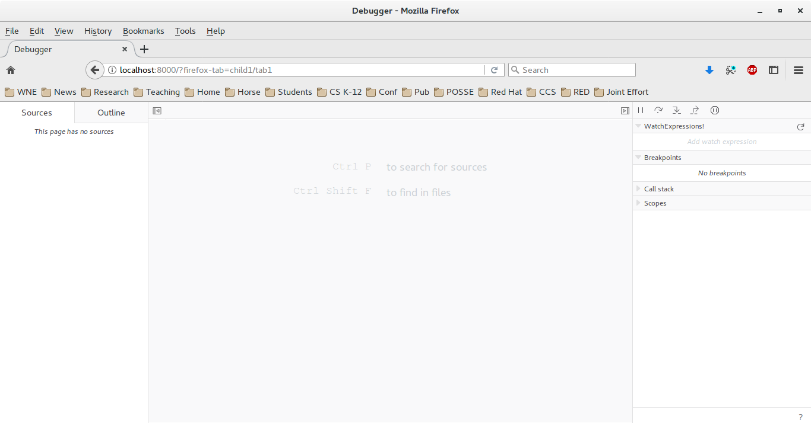

## Make a Change to the Debugger
**Pre-requisite:** Must have the DevTools developer environment set up with a launchpad browser instance that contains the debugger code and a display browser instance that contains the code that the debugger is working on. 

1. First ensure that you are viewing the "LaunchPad" browser (originally started with the URL "localhost:8000") and that it shows the debugger.

2. Note the header, "WatchExpressions", in the right panel.
3. In the code base, edit the file debugger.html/assets/panel/debugger.properties as follows. 
   1. Go to the line that contains the following:  watchExpressions.header=Watch Expressions
   2. Modify that line to be: watchExpressions.header=WatchExpressions!
4. Save the file; then reload the debugger tab of the "LaunchPad" browser 
5. View the change in the “WatchExpressions!” heading.
### Note:
* Make sure that you are looking at the debugger in the launchpad browser instance.
